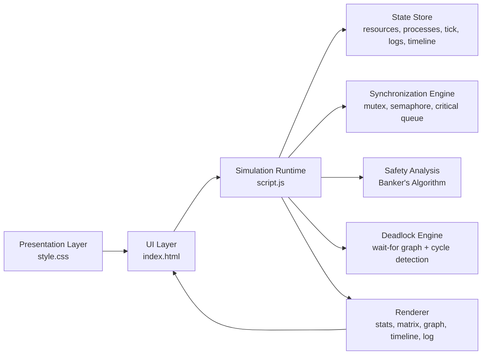
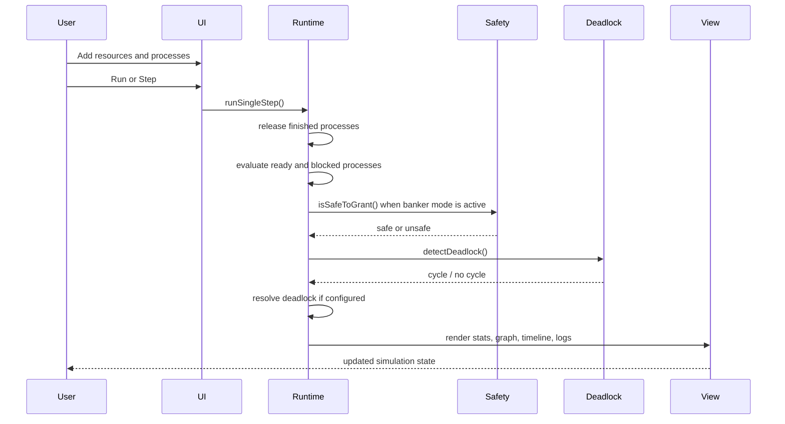
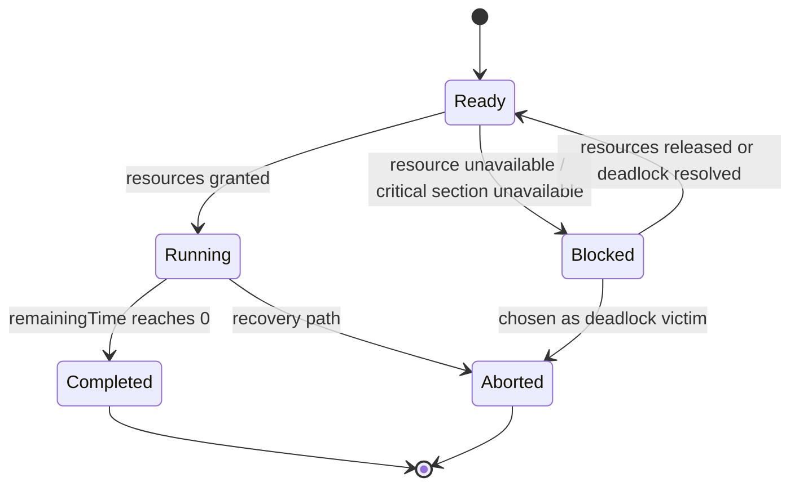

# OS Assignment 2

Interactive Operating System simulation focused on process synchronization, shared-resource coordination, deadlock detection, and deadlock recovery.

[Live Demo](https://osassignment-2-publish.vercel.app)  
[Project Documentation](./Assignment2_Documentation.md)

## Overview

This project is a browser-based simulation that models how an operating system coordinates concurrent processes competing for shared resources such as files and memory. It allows a user to define resources, create dependent processes, choose a synchronization strategy, and observe how the system behaves under contention.

The implementation is intentionally educational but engineered as a real interactive system: there is a central runtime state model, deterministic step-based execution, safety analysis through Banker's Algorithm, cycle-based deadlock detection, and live visualization of state transitions.

## Why This Project Matters

Operating systems are not only about CPU scheduling. Once multiple processes share the same resources, correctness becomes a coordination problem. This simulator demonstrates that coordination problem in a visual way:

- how shared resources are allocated
- how processes become blocked
- how wait-for relationships form
- how circular wait becomes deadlock
- how a safe sequence can be computed before granting a request
- how the system can recover when deadlock is detected

## Live Deployment

- Production URL: [https://osassignment-2-publish.vercel.app](https://osassignment-2-publish.vercel.app)
- Vercel Project: [https://vercel.com/babar-naeems-projects/osassignment-2-publish](https://vercel.com/babar-naeems-projects/osassignment-2-publish)

## Core Features

- Multiple synchronization modes:
  - Mutex
  - Semaphore
  - Critical Section Queue
- Two deadlock handling strategies:
  - Detect and resolve
  - Banker's safety check
- Dynamic resource creation with typed shared resources
- Process modeling with:
  - initial allocation
  - outstanding request
  - maximum demand
  - critical-section duration
  - shared target
- Wait-for graph visualization
- Critical-section execution timeline
- Real-time event log
- Built-in classic deadlock scenario for demonstration
- Fully client-side deployment with no backend dependency

## System Architecture



## Execution Model

The simulator uses a deterministic tick-based runtime.

1. The user configures resources and processes.
2. The simulator advances one tick at a time or through continuous run mode.
3. Running processes spend time in the critical section.
4. Ready or blocked processes attempt resource acquisition.
5. Synchronization rules decide whether entry is allowed.
6. Banker's Algorithm can reject unsafe grants before they happen.
7. Blocked processes form wait-for relationships.
8. Deadlock detection checks for cycles in the wait-for graph.
9. Recovery logic can abort a victim process and release held resources.
10. The UI re-renders the complete system state after each step.

## Runtime Flow



## Deadlock Detection Strategy

Blocked processes maintain `waitingFor` relationships. These relationships form a wait-for graph. The deadlock engine performs cycle detection using depth-first search:

- each blocked process becomes a graph node
- each dependency becomes a directed edge
- if traversal re-enters a node already on the active stack, a cycle exists
- the cycle is reported as deadlock participants

In detect-and-resolve mode, the runtime selects a victim process by highest allocated resource count, aborts it, releases its resources, and unblocks the remaining candidates.

## Banker's Algorithm Integration

In banker mode, resource grants are simulated before being committed. The runtime computes:

- current allocation
- available resources
- remaining need
- candidate safe sequence

If no full safe sequence exists, the request is deferred rather than granted. This allows the simulator to distinguish between:

- a currently safe state
- an unsafe but not yet deadlocked state
- an actual deadlocked state

## State Model

The runtime is centered around a single state object:

```text
state
|- resources[]
|- processes[]
|- tick
|- syncMode
|- detectionMode
|- timeline[]
|- logs[]
|- safeSequence[]
```

Each process carries enough information to support both visualization and analysis:

- `initialAllocation`
- `currentAllocation`
- `initialRequest`
- `request`
- `maxDemand`
- `sharedTarget`
- `state`
- `remainingTime`
- `waitingFor`
- `aborted`

## Process Lifecycle



## UI Composition

The interface is deliberately split into a control side and an observability side.

### Control Surface

- synchronization mode selector
- deadlock strategy selector
- simulation speed control
- resource creation form
- process creation form
- run, step, reset, resolve, and clear actions

### Observability Surface

- high-level system stats
- shared resource cards
- process dependency matrix
- wait-for graph
- critical-section timeline
- event log

This separation keeps the app usable during demos and makes the underlying operating-system concepts easier to explain.

## Codebase Structure

```text
.
├─ index.html                      # Application shell and UI containers
├─ style.css                       # Visual system, responsive layout, component styling
├─ script.js                       # Simulation runtime, safety logic, deadlock handling, rendering
├─ Assignment2_Documentation.md    # Full written assignment report
├─ Assignment2_Documentation.docx  # Word version of the report
└─ OS_Assignments_with_Project.pdf # Original assignment brief
```

## File Responsibilities

### `index.html`

Defines the full simulation interface, including:

- configuration controls
- forms for resource and process creation
- system stat cards
- resource cards container
- dependency matrix
- wait-for graph panel
- timeline panel
- event log panel

### `script.js`

Implements the runtime and analysis layer:

- state initialization
- resource parsing and validation
- process insertion and normalization
- tick-based execution loop
- synchronization decisions
- deadlock detection through DFS
- deadlock resolution through victim selection
- Banker's Algorithm safety checking
- rendering of stats, tables, graph, timeline, and log

### `style.css`

Implements the full presentation system:

- glassmorphism panel treatment
- responsive two-column layout
- process and state visualization components
- graph and timeline styling
- card and table hierarchy

## Engineering Decisions

### Single Runtime State

The project uses a central in-memory state model rather than scattered DOM-driven logic. That choice makes the simulator easier to reason about, easier to extend, and much more suitable for stepwise execution.

### Step-Based Simulation

A tick-based runtime was chosen over continuous arbitrary timing because it keeps the state transitions deterministic and explainable. That matters for academic demonstration and debugging.

### Analysis Before Rendering

The runtime computes deadlock and safety information first, then pushes the result into the UI. This creates a clean separation between system logic and presentation.

### No Backend Requirement

The entire project runs in the browser, which makes it easy to deploy, easy to evaluate, and easy to present in interviews, coursework, or portfolio reviews.

## Sample Scenario

The project ships with a built-in circular-wait example:

- `P1` holds `FileA` and requests `FileB`
- `P2` holds `FileB` and requests `FileA`

This scenario is useful because it demonstrates:

- hold-and-wait
- mutual exclusion
- circular dependency
- deadlock detection
- deadlock recovery

## How To Run Locally

Because this is a static web project, local execution is simple.

### Option 1

Open `index.html` directly in a browser.

### Option 2

Serve the folder from a lightweight static server if you prefer a local host URL.

## Recommended Demo Flow

1. Open the live deployment.
2. Show the preloaded resource structure.
3. Add two processes with opposing requests.
4. Run in mutex mode.
5. Observe blocked processes and wait-for relationships.
6. Switch to banker mode and show safe versus unsafe grants.
7. Load the classic deadlock preset.
8. Demonstrate automatic recovery.

## Professional Highlights

This project demonstrates skills that transfer well beyond coursework:

- modeling domain logic in a structured state machine
- translating algorithms into interactive products
- building explainable visualizations for complex systems
- designing deterministic simulations for debugging and demos
- shipping polished frontend work with production deployment
- documenting technical work clearly for evaluators and recruiters

## Future Improvements

- persistent scenario storage
- editable graph visualization with edges and ownership nodes
- richer deadlock recovery policies
- scheduling integration from Assignment 1
- exportable simulation traces
- test harness for algorithm validation

## Author Notes

This repository is part of an Operating System Concepts project and focuses specifically on Assignment 2: Process Synchronization and Deadlock Simulation. The implementation is designed to balance correctness, clarity, and presentation quality so it works well both as an academic submission and as a portfolio artifact.

## License

This project is shared for academic and portfolio purposes.

